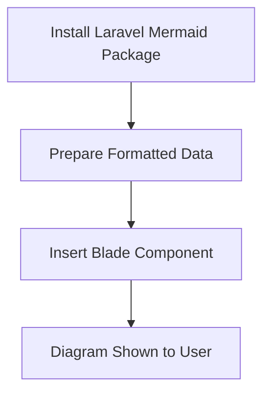

# laravel-mermaid
Simple Mermaid diagrams for Laravel applications. Laravel Mermaid is a package that allows you to easily generate Mermaid diagrams in your Laravel applications. Diagram types include flowcharts, user journeys, entity relationship diagrams and mind maps. 

## Mermaid Diagrams
Mermaid is a powerful digram and charting library that provides a syntax similar to markdown to generate data visualisations. Mermaid is now supported inside Github markdown and natively inside Notion pages so it is a familar syntax for business users. 


You can find out more about the Mermaid JS library at https://mermaid.js.org

## Installation

You can install the package via composer:

```bash
composer require icehouse-ventures/laravel-mermaid
```

## Blade Component 
The package provides a Blade component that you can use to generate Mermaid diagrams in your views. Here is an example of how you can use the Blade component to generate a simple flowchart diagram:

```php
<x-mermaid::mermaid>
    graph TD;
        A-->B;
        A-->C;
        B-->D;
        C-->D;
</x-mermaid::mermaid>
```
## Background
Icehouse Ventures is an early-stage venture capital firm based in New Zealand. We have an in-house technology platform built using Laravel and created this package to help streamline the generation of flowcharts, process diagrams and data visualisations inside our application using dynamic data. 

## License

The MIT License (MIT). Please see [License File](LICENSE.md) for more information.
