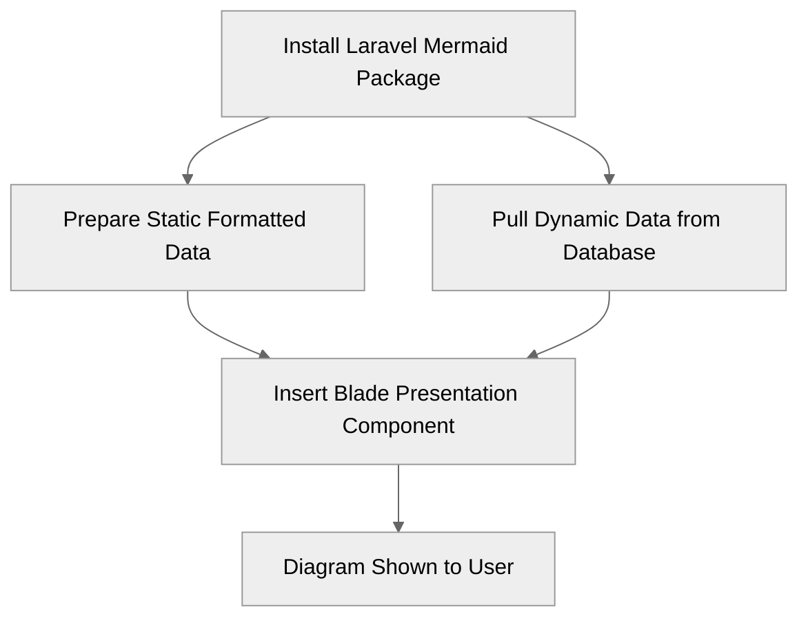
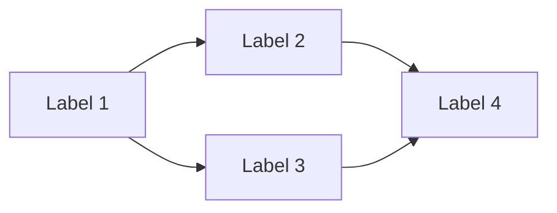
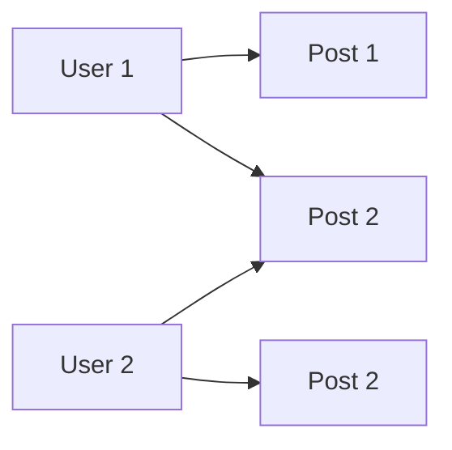
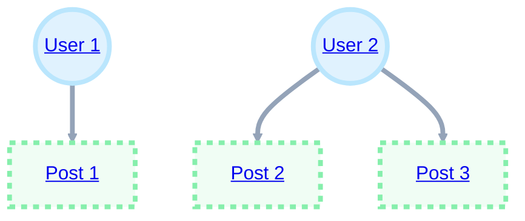

# laravel-mermaid
Simple Mermaid diagrams for Laravel applications. Laravel Mermaid is a package that allows you to easily generate Mermaid diagrams in your Laravel applications. Diagram types include flowcharts, user journeys, entity relationship diagrams, business process diagrams and mind maps. 

## Mermaid Diagrams
Mermaid is a powerful digram and charting library that provides a syntax similar to markdown to generate data visualisations. Mermaid is now supported inside Github markdown and natively inside Notion pages so it is a familar syntax for business users. 


You can find out more about the Mermaid JS library at https://mermaid.js.org

## Installation

You can install the package via composer:

```bash
composer require icehouse-ventures/laravel-mermaid
```

## Quickstart: Blade Component Slot
The package provides a Blade component that you can use to generate Mermaid diagrams in your views. Here is an example of how you can use the Blade component to generate a simple flowchart diagram. The component can be wrapped around any standard Mermaid diagram string (similar to Markdown strings).

```php
<x-mermaid::component>
    graph TD;
        A-->B;
        A-->C;
        B-->D;
        C-->D;
</x-mermaid::component>
```

## Passing mermaid syntax to the Blade Component using the Data Attribute
You can pass data directly to the Blade component using the `data` attribute. The data should be a string that represent the Mermaid diagram. Here is an example of how you can pass data to the Blade component. You'll need to use the Mermaid syntax to generate the diagram using this method. 

```php
// In your controller
public function index()
{
    $data = 
        'graph LR;
            A[Label 1];
            A-->B;
            A-->C;
            B[Label 2];
            B-->D;
            C[Label 3];
            C-->D;
            D[Label 4];';

    return view('your-view', compact('data'));
}

// Your page blade file
<x-mermaid::component :data="$data" />
```



## Passing an Array to the Blade Component
Laravel and php provide a lot of helpers and convinience methods for working with arrays. If you want to create dynamic diagrams from your business data, then an array is a more dynamic data format to pass into the Mermaid digram. You can pass an array into the Mermaid Blade component using the Generate Diagram From Array method. The package will automatically convert the array to a single string to generate the Mermaid diagram. Here is an example of how you can pass an array to the Blade component:

```php
// In your controller
use IcehouseVentures\LaravelMermaid\Facades\Mermaid;

public function index()
{
    $data = [
        'A-->B',
        'A-->C',
        'B-->D',
        'C-->D'
    ];

    Mermaid::build()->generateDiagramFromArray($data);

    return view('your-view', compact('data'));
}

// Your page blade file
<x-mermaid::component :data="$data" />
```


## Passing in an Eloquent Collection
You can also pass in an Eloquent collection to the Blade component. This allows you to visualise complex business data and relationships straight from your Eloquent models and their relationships. The package will automatically convert the collection to an array of strings that represent the Mermaid diagram using the Generate Diagram From Collection method. Here is an example of how you can pass an Eloquent collection to the Blade component:

```php
// In your controller
use IcehouseVentures\LaravelMermaid\Facades\Mermaid;

public function index()
{
    $collection = User::with('posts')->get();
    
    $data = Mermaid::build()->generateDiagramFromCollection($collection);
    
    return view('your-view', compact('data'));
}

// Your page blade file
<x-mermaid::component :data="$data" />
```


## Custom collections, models and relationships
You can also pass in custom collections, models and relationships to the Blade component by flattening the data into an array, then using the array method in the package to generate the diagram. This method is useful if you want more complex dynamic data such as links or custom formatting.


```php
use IcehouseVentures\LaravelMermaid\Facades\Mermaid;

$users = User::with('posts')->take(3)->get();

$data = [];
$data[] = "classDef user fill:#e0f2fe,stroke:#bae6fd,stroke-width:4px";
$data[] = "classDef post fill:#f0fdf4,stroke:#86efac,stroke-width:4px,color:#1e3a8a,stroke-dasharray: 5 5";

foreach ($users as $user) {
    $data[] = "U{$user->id}((<a href="route('user.show', $user)">$user->name</a>))";

    foreach ($user->posts as $post) {
        $data[] = "P{$post->id}[<a href="route('post.show', $post)">$post->title</a>]";
        $data[] = "U{$user->id} --> P{$post->id}";
    }
}

$data[] = "class U1,U2 user";
$data[] = "class P1,P2,P3 post";
$data[] = "linkStyle default stroke:#94a3b8,stroke-width:4px";

$data = Mermaid::build()->generateDiagramFromArray($data);
```




## Configuration
You can customize the Mermaid configuration by publishing the `mermaid.php` config file and changing the settings as needed. You can publish the configuration file using the following command:

```bash
php artisan vendor:publish --provider="IcehouseVentures\LaravelMermaid\ServiceProvider" --tag="config"
```

This will create a `mermaid.php` file in your `config` directory. For example the configuration file allows you to set the default theme for the Mermaid diagrams. The default theme is `default` but you can change this to `forest`, `dark`, `neutral` or `base`. 

By default the package uses a Tailwind inspired theme. You can change the theme by updating the `theme` key in the configuration file.

## Canvas Style
You can also set the canvas style for the Mermaid diagram by passing in a class to the Blade component. This allows you to style the diagram using your own CSS. 

```php
<x-mermaid::component :data="$data" class="border rounded p-2" />
```

## Livewire
This package includes a Livewire compatible component that will re-render a diagram when a property on your Livewire component is updated. This allows you to create dynamic interactive diagrams and visualisations that can be updated when a user interacts with your application. Here's an example of using this in a Livewire component when when you increase the 'limit', more users will be loaded and added to the diagram.

```php

// Your Livewire Class:
<?php

namespace App\Livewire;

use App\Models\User;
use Livewire\Component;
use IcehouseVentures\LaravelMermaid\Facades\Mermaid;

class Mermaid extends Component
{
    public $limit = 2;

    public $mermaid;

    public function render()
    {
        $this->mermaid = Mermaid::build()->generateDiagramFromCollection(
            User::with('posts')->limit($this->limit)->get()
        );

        return view('livewire.mermaid');
    }
}

// Your Livewire View:
<div>
    <x-mermaid::livewire-component wire:model="mermaid" />

    <div>
        <label for="limit">Limit:</label>
        <input wire:model.live="limit" id="limit" type="number">
    </div>
</div>
```


## Background
Icehouse Ventures is an early-stage venture capital firm based in New Zealand. We have an in-house technology platform built using Laravel and created this package to help streamline the generation of flowcharts, process diagrams and data visualisations inside our application using dynamic data. 

## License

The MIT License (MIT). Please see [License File](LICENSE.md) for more information.
